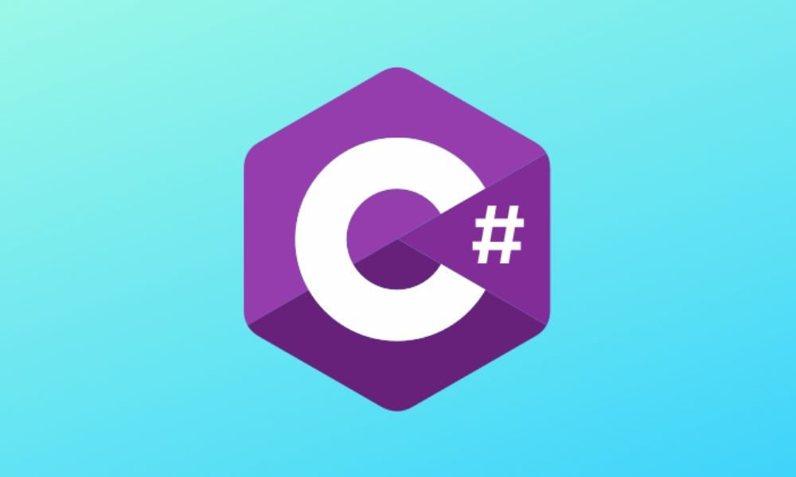

## Blazor, C#'s Latest Challenger

In this article, I will be looking back at my post about changing the log level from 2017. But this time, it will not be a full-featured platform like .NET Core 3.1 - but rather a browser with Blazor WebAssembly and .NET Standard code. The reason I use this feature is still the same as in 2017: By default, my applications usually have a log level of Information. If there is an issue in my code, I want to know the reason for it and then I need to lower the log level to get more information without rebuilding or restarting the application - in other words. reload the SPA. The main reason a reload of the app is undesirable is that the issue (which may be hard to reproduce) may just disappear.




```html
<div>Hello World</div>
```

```css
.imperio {
  color: blue;
}
```

```js
const harry = spell(`lumos`)
```

| Syntax    | Description | Type         | Style  | Another Column      |
| --------- | ----------- | ------------ | ------ | ------------------- |
| Header    | Title       | HTML Element | Simple | More Boring Info    |
| Paragraph | Text        | HTML Element | Simple | And Some More Stuff |
